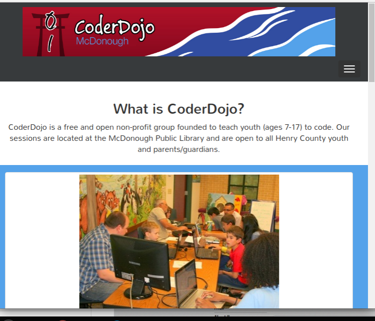

#Re-build CoderDojo McDonough Website
I volunteered to redo the CoderDojo McDonough website. Here are snapshots of what it looked like before. Note, the blog posts were outdated & the webpage was not responsive. As of mid-September, the updates I made in this repository went live (http://coderdojohenry.com/). Going forward, I'll make contributions directly to the CoderMcDonough website repository instead of here. 

#Before

#After

